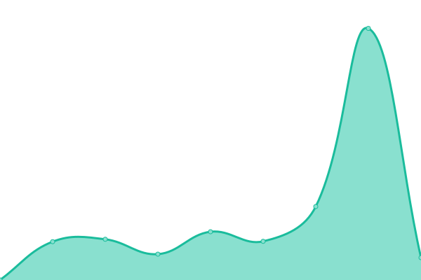

# [📈 Live Status](https://upptime.sny.sh): <!--live status--> **🟩 All systems operational**

This repository contains the open-source uptime monitor and status page for [Sunny](https://sny.sh), powered by [Upptime](https://github.com/upptime/upptime).

With [Upptime](https://upptime.js.org), you can get your own unlimited and free uptime monitor and status page, powered entirely by a GitHub repository. We use [Issues](https://github.com/TheLastZombie/upptime/issues) as incident reports, [Actions](https://github.com/TheLastZombie/upptime/actions) as uptime monitors, and [Pages](https://upptime.sny.sh) for the status page.

<!--start: status pages-->
<!-- This summary is generated by Upptime (https://github.com/upptime/upptime) -->
<!-- Do not edit this manually, your changes will be overwritten -->
<!-- prettier-ignore -->
| URL | Status | History | Response Time | Uptime |
| --- | ------ | ------- | ------------- | ------ |
|  [AdGuard](https://adguard.sny.sh) | 🟩 Up | [ad-guard.yml](https://github.com/TheLastZombie/upptime/commits/HEAD/history/ad-guard.yml) | 

 1369ms
     
 | 

<a href="https://upptime.sny.sh/history/ad-guard">100.00%</a>
    

|  [Agreper](https://agreper.sny.sh) | 🟩 Up | [agreper.yml](https://github.com/TheLastZombie/upptime/commits/HEAD/history/agreper.yml) | 

 1094ms
     
 | 

<a href="https://upptime.sny.sh/history/agreper">100.00%</a>
    

|  [Copyparty](https://copyparty.sny.sh) | 🟩 Up | [copyparty.yml](https://github.com/TheLastZombie/upptime/commits/HEAD/history/copyparty.yml) | 

 972ms
     
 | 

<a href="https://upptime.sny.sh/history/copyparty">100.00%</a>
    

|  [Faircamp](https://faircamp.sny.sh) | 🟩 Up | [faircamp.yml](https://github.com/TheLastZombie/upptime/commits/HEAD/history/faircamp.yml) | 

 1430ms
     
 | 

<a href="https://upptime.sny.sh/history/faircamp">100.00%</a>
    

|  [Forgejo](https://forgejo.sny.sh) | 🟩 Up | [forgejo.yml](https://github.com/TheLastZombie/upptime/commits/HEAD/history/forgejo.yml) | 

 1161ms
     
 | 

<a href="https://upptime.sny.sh/history/forgejo">100.00%</a>
    

|  [Gallery](https://gallery.sny.sh) | 🟩 Up | [gallery.yml](https://github.com/TheLastZombie/upptime/commits/HEAD/history/gallery.yml) | 

 826ms
     
 | 

<a href="https://upptime.sny.sh/history/gallery">100.00%</a>
    

|  [GoToSocial](https://gotosocial.sny.sh) | 🟩 Up | [go-to-social.yml](https://github.com/TheLastZombie/upptime/commits/HEAD/history/go-to-social.yml) | 

 1086ms
     
 | 

<a href="https://upptime.sny.sh/history/go-to-social">100.00%</a>
    

|  [LibreY](https://librey.sny.sh) | 🟩 Up | [libre-y.yml](https://github.com/TheLastZombie/upptime/commits/HEAD/history/libre-y.yml) | 

 829ms
     
 | 

<a href="https://upptime.sny.sh/history/libre-y">100.00%</a>
    

|  [Linx](https://linx.sny.sh) | 🟩 Up | [linx.yml](https://github.com/TheLastZombie/upptime/commits/HEAD/history/linx.yml) | 

 958ms
     
 | 

<a href="https://upptime.sny.sh/history/linx">100.00%</a>
    

|  [Maloja](https://maloja.sny.sh) | 🟩 Up | [maloja.yml](https://github.com/TheLastZombie/upptime/commits/HEAD/history/maloja.yml) | 

 4406ms
     
 | 

<a href="https://upptime.sny.sh/history/maloja">100.00%</a>
    

|  [Navidrome](https://navidrome.sny.sh) | 🟩 Up | [navidrome.yml](https://github.com/TheLastZombie/upptime/commits/HEAD/history/navidrome.yml) | 

 1139ms
     
 | 

<a href="https://upptime.sny.sh/history/navidrome">100.00%</a>
    

|  [Prosody](https://prosody.sny.sh) | 🟩 Up | [prosody.yml](https://github.com/TheLastZombie/upptime/commits/HEAD/history/prosody.yml) | 

 879ms
     
 | 

<a href="https://upptime.sny.sh/history/prosody">100.00%</a>
    

|  [Radicale](https://radicale.sny.sh) | 🟩 Up | [radicale.yml](https://github.com/TheLastZombie/upptime/commits/HEAD/history/radicale.yml) | 

 1086ms
     
 | 

<a href="https://upptime.sny.sh/history/radicale">100.00%</a>
    

|  [Tent](https://tent.sny.sh) | 🟩 Up | [tent.yml](https://github.com/TheLastZombie/upptime/commits/HEAD/history/tent.yml) | 

 1008ms
     
 | 

<a href="https://upptime.sny.sh/history/tent">100.00%</a>
    

|  [Website](https://sny.sh) | 🟩 Up | [website.yml](https://github.com/TheLastZombie/upptime/commits/HEAD/history/website.yml) | 

 480ms
     
 | 

<a href="https://upptime.sny.sh/history/website">100.00%</a>
    

<!--end: status pages-->

[**Visit our status website →**](https://upptime.sny.sh)

## 📄 License

- Powered by: [Upptime](https://github.com/upptime/upptime)
- Code: [MIT](./LICENSE) © [Sunny](https://sny.sh)
- Data in the `./history` directory: [Open Database License](https://opendatacommons.org/licenses/odbl/1-0/)
