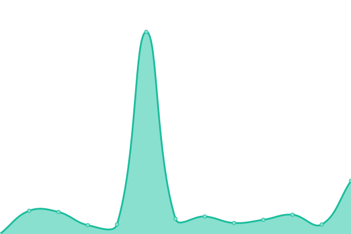

# [📈 Live Status](https://upptime.sny.sh): <!--live status--> **🟥 Complete outage**

This repository contains the open-source uptime monitor and status page for [Sunny](https://sny.sh), powered by [Upptime](https://github.com/upptime/upptime).

With [Upptime](https://upptime.js.org), you can get your own unlimited and free uptime monitor and status page, powered entirely by a GitHub repository. We use [Issues](https://github.com/TheLastZombie/upptime/issues) as incident reports, [Actions](https://github.com/TheLastZombie/upptime/actions) as uptime monitors, and [Pages](https://upptime.sny.sh) for the status page.

<!--start: status pages-->
<!-- This summary is generated by Upptime (https://github.com/upptime/upptime) -->
<!-- Do not edit this manually, your changes will be overwritten -->
<!-- prettier-ignore -->
| URL | Status | History | Response Time | Uptime |
| --- | ------ | ------- | ------------- | ------ |
|  [AdGuard](https://adguard.sny.sh) | 🟥 Down | [ad-guard.yml](https://github.com/TheLastZombie/upptime/commits/HEAD/history/ad-guard.yml) | 

 1161ms
     
 | 

<a href="https://upptime.sny.sh/history/ad-guard">99.79%</a>
    

|  [Baïkal](https://baikal.sny.sh) | 🟥 Down | [baikal.yml](https://github.com/TheLastZombie/upptime/commits/HEAD/history/baikal.yml) | 

 1255ms
     
 | 

<a href="https://upptime.sny.sh/history/baikal">99.79%</a>
    

|  [Dufs](https://dufs.sny.sh) | 🟥 Down | [dufs.yml](https://github.com/TheLastZombie/upptime/commits/HEAD/history/dufs.yml) | 

 902ms
     
 | 

<a href="https://upptime.sny.sh/history/dufs">99.79%</a>
    

|  [Faircamp](https://faircamp.sny.sh) | 🟥 Down | [faircamp.yml](https://github.com/TheLastZombie/upptime/commits/HEAD/history/faircamp.yml) | 

 997ms
     
 | 

<a href="https://upptime.sny.sh/history/faircamp">99.79%</a>
    

|  [Forgejo](https://forgejo.sny.sh) | 🟥 Down | [forgejo.yml](https://github.com/TheLastZombie/upptime/commits/HEAD/history/forgejo.yml) | 

 1086ms
     
 | 

<a href="https://upptime.sny.sh/history/forgejo">99.79%</a>
    

|  [Gallery](https://gallery.sny.sh) | 🟥 Down | [gallery.yml](https://github.com/TheLastZombie/upptime/commits/HEAD/history/gallery.yml) | 

 898ms
     
 | 

<a href="https://upptime.sny.sh/history/gallery">99.79%</a>
    

|  [GoToSocial](https://gotosocial.sny.sh) | 🟥 Down | [go-to-social.yml](https://github.com/TheLastZombie/upptime/commits/HEAD/history/go-to-social.yml) | 

 901ms
     
 | 

<a href="https://upptime.sny.sh/history/go-to-social">99.79%</a>
    

|  [LibreY](https://librey.sny.sh) | 🟥 Down | [libre-y.yml](https://github.com/TheLastZombie/upptime/commits/HEAD/history/libre-y.yml) | 

 1045ms
     
 | 

<a href="https://upptime.sny.sh/history/libre-y">99.79%</a>
    

|  [Linx](https://linx.sny.sh) | 🟥 Down | [linx.yml](https://github.com/TheLastZombie/upptime/commits/HEAD/history/linx.yml) | 

 734ms
     
 | 

<a href="https://upptime.sny.sh/history/linx">99.79%</a>
    

|  [Maloja](https://maloja.sny.sh) | 🟥 Down | [maloja.yml](https://github.com/TheLastZombie/upptime/commits/HEAD/history/maloja.yml) | 

 3567ms
     
 | 

<a href="https://upptime.sny.sh/history/maloja">99.79%</a>
    

|  [Navidrome](https://navidrome.sny.sh) | 🟥 Down | [navidrome.yml](https://github.com/TheLastZombie/upptime/commits/HEAD/history/navidrome.yml) | 

 915ms
     
 | 

<a href="https://upptime.sny.sh/history/navidrome">99.79%</a>
    

|  [Tent](https://tent.sny.sh) | 🟥 Down | [tent.yml](https://github.com/TheLastZombie/upptime/commits/HEAD/history/tent.yml) | 

 2644ms
     
 | 

<a href="https://upptime.sny.sh/history/tent">99.79%</a>
    

|  [Website](https://sny.sh) | 🟥 Down | [website.yml](https://github.com/TheLastZombie/upptime/commits/HEAD/history/website.yml) | 

 508ms
     
 | 

<a href="https://upptime.sny.sh/history/website">99.79%</a>
    

<!--end: status pages-->

[**Visit our status website →**](https://upptime.sny.sh)

## 📄 License

- Powered by: [Upptime](https://github.com/upptime/upptime)
- Code: [MIT](./LICENSE) © [Sunny](https://sny.sh)
- Data in the `./history` directory: [Open Database License](https://opendatacommons.org/licenses/odbl/1-0/)
